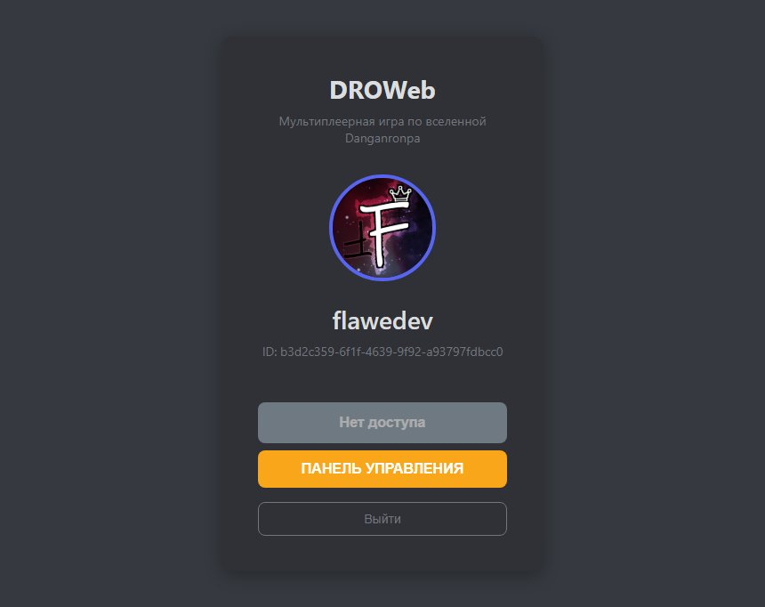
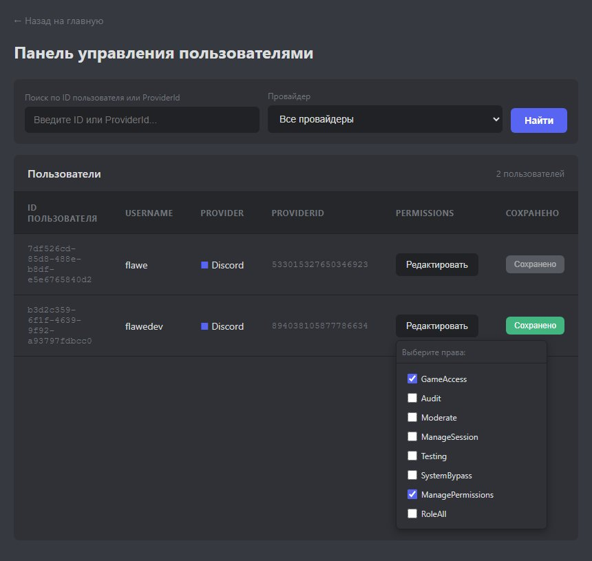
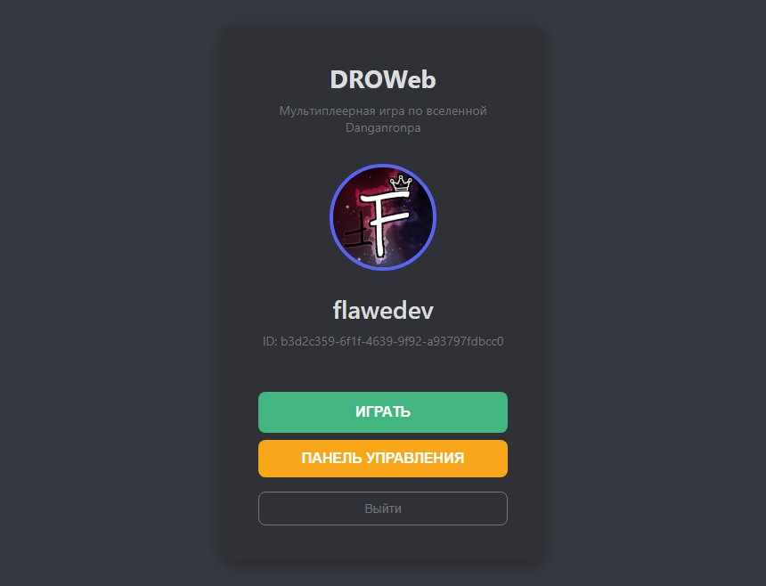
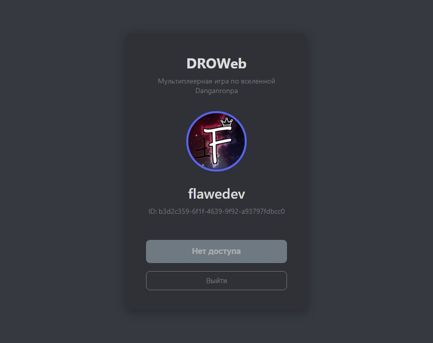
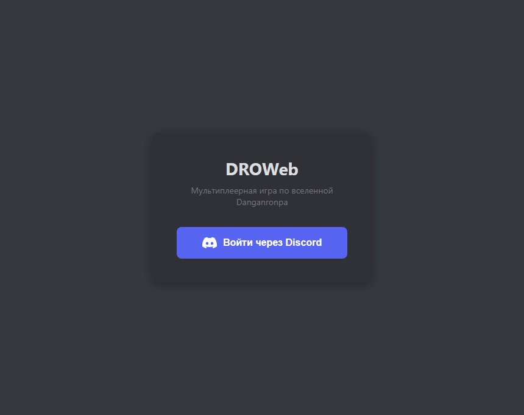

# DROWeb.Backend

> **Примечание:** Это учебный проект. Код предоставляется в образовательных целях.

Это серверный бэкенд для фанатской мультиплеерной игры по вселенной Danganronpa.

**Важно:** Данный репозиторий содержит только серверный код. Ассеты, защищенные авторским правом (арты, музыка, тексты и т.д.), не распространяются и не включены в этот проект.

## Связанные репозитории

| Репозиторий | Описание |
|-------------|----------|
| [DROWeb.Backend](https://github.com/FlaweDev/DROWeb.Backend) | ASP.NET WebAPI сервер |
| [DROWeb.Deploy](https://github.com/FlaweDev/DROWeb.Deploy) — в разработке | Kubernetes/helm конфигурация |
| [DROWeb.Unity](https://github.com/FlaweDev/DROWeb.Unity) — в разработке | Игровой клиент на движке Unity |

## Доступ и права

При первом запуске в указанной базе данных будут созданы таблицы `Users` и `ExternalAuths`.

**Шаг 1.** Для начала работы необходимо выдать себе права `ManagePermissions`:
```sql
UPDATE public."Users" SET "Permissions" = 1073741824 WHERE "Id" = '00000000-0000-0000-0000-000000000000'
```

**Шаг 2.** После выдачи прав необходимо перезайти.



## Интерфейс администратора

Панель администратора доступна по адресу `/admin` после получения прав.



Здесь можно:
- Управлять правами отдельных пользователей
- Отметить `GameAccess` для предоставления доступа к игре

После выдачи прав клиент будет автоматически переподключен (см. TODO: автопродление токенов).

## Доступ к игре

При наличии права `GameAccess` у пользователя появляется зелёная кнопка «Играть», ведущая на `/game`.



## Ограничения

Без необходимых прав пользователь видит соответствующее сообщение:





## TODO

* [ ] Реализовать механизм Refresh Tokens для автопродления сессий.

* [ ] Распределенное кэширование: миграция с InMemoryCache на Redis для хранения сессий и пермишенов.

* [ ] Покрытие кода Unit-тестами и валидация входящих DTO (FluentValidation).

* [ ] Реализовать эндпоинт аутентификации (Forward Auth) для Ingress-роутера для контроля доступа к ресурсам R3 Storage.

## Как запустить локально

### Требования

- .NET 10.0 SDK
- PostgreSQL (опционально, по умолчанию используется SQLite)

### Шаги

1. **Клонируйте репозиторий**
   ```bash
   git clone <repo-url>
   ```

2. **Настройте `.env`** (используйте `.env.example`). Вам понадобятся:
   * Данные приложения `Discord Client ID/Secret`.
   * Настройки подключения к PostgreSQL (по умолчанию в `appsettings.Development` используется `"USE_SQLITE": "true"`).

3. **Запустите приложение**
   ```bash
   dotnet run --project DROWeb.WebAPI
   ```

   Сервер запустится на `https://localhost:7001`.

## Стек

| Компонент | Технология |
|-----------|------------|
| Framework | ASP.NET 10.0 |
| ORM | Entity Framework Core 10.0 |
| API Framework | FastEndpoints 8.1.0 |
| Database (Prod) | PostgreSQL (Npgsql) |
| Database (Dev) | SQLite |
| Auth | Cookie Authentication |
| Auth Provider | Discord OAuth (AspNet.Security.OAuth.Discord) |

## CI/CD с GitHub Actions

### Поток работы

При пуше в репозиторий запускается CI/CD пайплайн (`deploy.yml`), который выполняет следующие этапы:

**1. Semantic Release** (ветки: `main`, `develop`)
- При пуше в `main` или ручном запуске (`workflow_dispatch`) — выпускает стабильную версию (`latest`)
- При пуше в `develop` — выпускает dev-версию (`dev`)

**2. Build & Pack**
- Сборка `DROWeb.WebAPI`
- Генерация UnitySDK через NSwag из OpenAPI спецификации
- Сборка UnitySDK (.NET Standard 2.1)
- Генерация `.meta` файлов для Unity (с помощью `metagen-gha`)
- Публикация UPM пакета в реестр Verdaccio

**3. Docker Image**
- Сборка образа `DROWeb.WebAPI`
- Пуш в GHCR с двумя тегами:
  - `ghcr.io/<owner>/droweb-backend:<version>` — конкретная версия
  - `ghcr.io/<owner>/droweb-backend:<latest|dev>` — алиас в зависимости от ветки

**4. Deploy to k3s**
- Деплой на k3s кластер через `kubectl`
- Обновление образа деплоя `droweb-backend` в namespace `app`

### Триггеры

| Ветка | Действие |
|-------|----------|
| `main` | Стабильный релиз (`latest`) |
| `develop` | Dev-версия (`dev`) |
| `workflow_dispatch` | Ручной запуск (стабильный релиз) |

### Переменные окружения (Repository Variables)

Добавьте в Settings → Variables and secrets → Variables:

| Переменная | Описание |
|------------|----------|
| `REGISTRY_HOST` | Хост реестра UPM пакетов (например, Verdaccio) |

### Секреты (Repository Secrets)

Добавьте в Settings → Secrets and variables → Actions:

| Секрет | Описание |
|--------|----------|
| `GITHUB_TOKEN` | Автоматически создается GitHub |
| `VERDACCIO_TOKEN` | Токен доступа к реестру UPM пакетов |
| `KUBE_CONFIG` | Base64-encoded kubeconfig для доступа к k3s кластеру |
